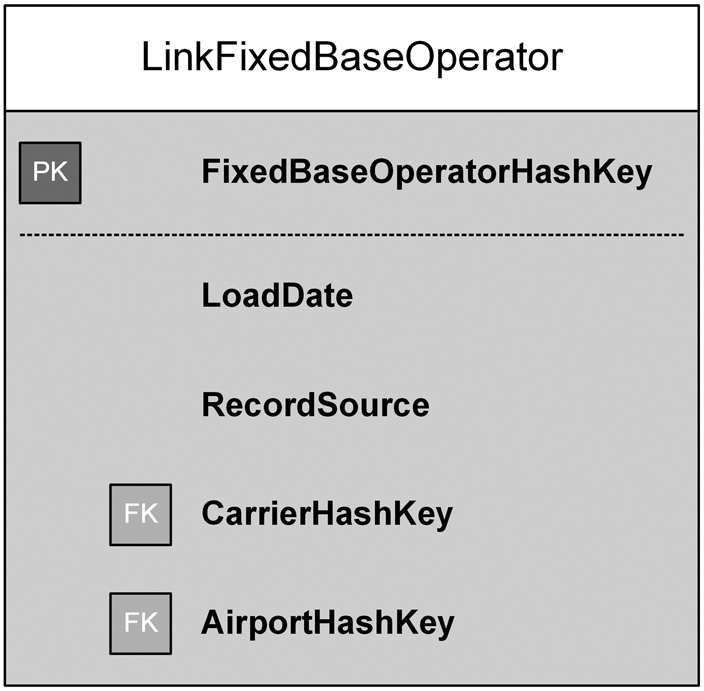

# 4.4 LINK DEFINITION

    The link entity type is responsible for modeling transactions, associations, hierarchies, and redefinitions of business terms. The next sections of this chapter define Data Vault links more formally. A link connects business keys; therefore links are modeled between hubs. Links capture and record the past, present, and future relationships between data elements at the lowest possible granularity. They don't capture time-lines or temporality because these concepts, including the active status of a relationship, are an expression of context, which is not the goal of links. For that reason, it is important that links not be end-dated and contain no other time or context information, except a Load Date attribute for technical and informative reasons. Links represent a relationship that currently exists or one that existed in the past.

    Тип сущности Link (Связь) отвечает за моделирование транзакций, ассоциаций, иерархий и переопределений бизнес-терминов. В следующих разделах этой главы определения связей Data Vault будут даны более формально. Связь соединяет бизнес-ключи; следовательно, связи моделируются между хабами (Hub). Связи фиксируют и записывают прошлые, настоящие и будущие отношения между элементами данных на максимально возможном уровне детализации (гранулярности). Они не фиксируют временные шкалы или темпоральность, поскольку эти концепции, включая статус активности отношения, являются выражением контекста, что не является целью связей. По этой причине важно, чтобы связи не имели даты окончания (end-dated) и не содержали никакой другой информации о времени или контексте, за исключением атрибута Load Date (Дата загрузки) по техническим и информационным соображениям. Связи представляют собой отношения, которые существуют в настоящее время или существовали в прошлом.

Adding temporality to link structures, for example by adding a Begin and End Date, bounds the relationship to a single timeline and forces the data warehouse to start and stop this relationship only once. This limitation should always be avoided because it will not hold true. For example, even if this limitation is acceptable for the organization right now, business might change. In addition, a relationship might be deleted in the source system by accident (or temporarily) and recovered in a later source extract. The Data Vault model should capture this temporary deletion for audit purposes, but the context information (the business side) should capture the reversed action.

    Добавление темпоральности к структурам связей, например, путем добавления дат начала (Begin Date) и окончания (End Date), ограничивает отношение единой временной шкалой и вынуждает хранилище данных инициировать и завершать это отношение только один раз. Этого ограничения следует всегда избегать, поскольку оно не будет соответствовать действительности в долгосрочной перспективе. Например, даже если такое ограничение приемлемо для организации прямо сейчас, бизнес-процессы могут измениться. Кроме того, отношение может быть случайно удалено в исходной системе (или временно) и восстановлено при последующей выгрузке из источника. Модель Data Vault должна зафиксировать это временное удаление для целей аудита, но информация о контексте (бизнес-сторона) должна отразить обратное действие (восстановление).

Data Vault links are implemented by tables that represent many-to-many relationships. They connect two or more hubs (or the same hub at least twice by using multiple hub references). A link contains the hash key of each connected hub along with some metadata, which is explained later in this chapter. A typical Data Vault link entity is presented in Figure 4.11.

    Связи Data Vault реализуются в виде таблиц, представляющих отношения «многие-ко-многим». Они соединяют два или более хаба (или один и тот же хаб как минимум дважды, используя множественные ссылки на хаб). Связь содержит хэш-ключ каждого подключенного хаба вместе с некоторыми метаданными, которые будут объяснены позже в этой главе. Типичная сущность связи Data Vault представлена на Рисунке 4.11.


![FIGURE 4.11 | A Data Vault link entity (physical design)]




<center>
  
</center>


The primary key of the entity is a hash key that identifies the link within the data warehouse. It is used by satellites that add context to the link or by other links that reference this link. The hash key also improves lookups when loading new records into the table and is based on the CarrierCode and AirportSeqID business keys, which are stored in the referenced hubs. The Load Date and Record Source attributes provide information about the time when the record was loaded and where it comes from.

    Первичным ключом сущности является хэш-ключ, который идентифицирует связь внутри хранилища данных. Он используется сателлитами, которые добавляют контекст к связи, или другими связями, которые ссылаются на эту связь. Хэш-ключ также улучшает производительность поиска при загрузке новых записей в таблицу и основывается на бизнес-ключах CarrierCode (Код перевозчика) и AirportSeqID (Идентификатор последовательности аэропорта), которые хранятся в связанных хабах. Атрибуты Load Date (Дата загрузки) и Record Source (Источник записи) предоставляют информацию о времени загрузки записи и о том, откуда она поступила.

Throughout the book, we will use the logical symbol shown in Figure 4.12 for Data Vault links. The shape of the entity is similar to a link in a chain, in order to increase the recognition of this basic entity. In addition, a chain icon is used for the same purpose. A Data Vault link connects two or more hubs (hub references); therefore it is always drawn in conjunction with them (Figure 4.13).

    На протяжении всей книги мы будем использовать логический символ, показанный на Рисунке 4.12, для обозначения связей Data Vault. Форма сущности похожа на звено цепи, чтобы повысить узнаваемость этой базовой сущности. Кроме того, для той же цели используется значок цепи. Связь Data Vault соединяет два или более хаба (ссылки на хабы); поэтому она всегда рисуется в совокупности с ними (Рисунок 4.13).

Links ensure the scalability of the Data Vault model. It is possible to start with a relatively small Data Vault model for the data warehouse and extend this model (to scale it out) by adding more hubs and links to create a larger model.

    Связи обеспечивают масштабируемость модели Data Vault. Возможно начать с относительно небольшой модели Data Vault для хранилища данных и расширить эту модель (масштабировать её), добавляя новые хабы и связи для создания более крупной модели.

---


## Комментарии и примеры

### 1. Философия отсутствия дат окончания в Link
В традиционном моделировании данных (например, в подходах Kimball или Inmon) таблицы связей часто содержат поля `Start_Date` и `End_Date` для отслеживания истории изменений отношений (например, когда сотрудник перестал работать в определенном отделе).

В Data Vault 2.0 подход принципиально иной:
*   **Link (Связь)** хранит только факт существования отношения в момент загрузки. Если отношение есть в источнике — запись появляется в Link с `Load_Date`.
*   **Satellite (Спутник)** хранит контекст и временные рамки. Именно в спутнике, прикрепленном к Link, хранятся атрибуты `Start_Date`, `End_Date` и флаги активности (например, `Is_Active`).

**Почему это важно?**
Представьте ситуацию: Сотрудник был привязан к Проекту А. Затем в源 системе произошла ошибка, и запись исчезла. Через неделю ошибку исправили, и запись появилась снова.
*   Если бы у Link была дата окончания, мы бы навсегда закрыли это отношение в момент исчезновения записи. Восстановить его корректно было бы сложно, так как модель предполагает одно начало и один конец.
*   В Data Vault:
    1.  Исчезновение записи в источнике означает, что новая строка в Link не загружается. Старая строка остается как исторический факт того, что отношение существовало ранее.
    2.  Появление записи снова создает новую строку в Link с новым `Load_Date`.
    3.  Спутник, прикрепленный к этим строкам Link, будет хранить статус: для первой периода — "Активен", затем (если логика бизнеса требует) статус может стать "Неактивен", а для новой строки — снова "Активен". Это позволяет вести полный аудит без потери данных.

### 2. Структура таблицы Link (Пример SQL)
Связь реализует отношение многие-ко-многим. Её первичный ключ — это хэш-сумма всех соединяемых бизнес-ключей.

Допустим, у нас есть:
*   Hub_Customer   (Ключ: Customer_ID)
*   Hub_Product    (Ключ: Product_ID)
*   Связь: Покупка (Customer покупает Product)

Таблица `Link_Customer_Product` будет выглядеть примерно так:

````sql
CREATE TABLE Link_Customer_Product (
    -- Первичный ключ: Хэш от комбинации бизнес-ключей
    Link_Hash_Key CHAR(32) NOT NULL, 
    
    -- Внешние ключи: Хэши связанных Хабов
    Hub_Customer_Hash_Key CHAR(32) NOT NULL,
    Hub_Product_Hash_Key CHAR(32) NOT NULL,
    
    -- Технические метаданные (обязательны)
    Load_Datetime TIMESTAMP NOT NULL,
    Record_Source VARCHAR(50) NOT NULL,
    
    PRIMARY KEY (Link_Hash_Key)
);
````

> Заметка: В этой таблице нет колонок Valid_From или Valid_To. Вся история хранится за счет появления новых строк с новыми Load_Datetime, если бизнес-правила требуют фиксации каждого события, или просто наличием одной строки, если факт отношения постоянен. Контекст (цена покупки, количество, даты действия сделки) уходит в Satellite_Link_Customer_Product.

### 3. Масштабируемость

Автор подчеркивает, что Link обеспечивает масштабируемость.
* Сценарий: Вы начали проект только с данными о Клиентах и Продуктах. У вас есть Hub_Customer, Hub_Product и Link_Buy.
* Изменение: Бизнес решил отслеживать, через какого Поставщика был получен товар.
* Решение в Data Vault: Вам не нужно переделывать существующие таблицы. Вы просто создаете новый Hub_Supplier и новую связь Link_Product_Supplier. Старая модель продолжает работать, новая часть добавляется параллельно. Это возможно именно потому, что связи изолированы и не содержат сложной бизнес-логики или временных ограничений внутри своей структуры.

### 4. Визуальное обозначение

В нотации Data Vault:
* Hub изображается как круг (или овал).
* Link изображается как ромб или звено цепи, соединяющее круги.
* Линии соединяют Link с соответствующими Хабами.

Это визуально напоминает цепь, где хабы — это звенья, а связи — соединения между ними, что подчеркивает идею неразрывной структуры данных.