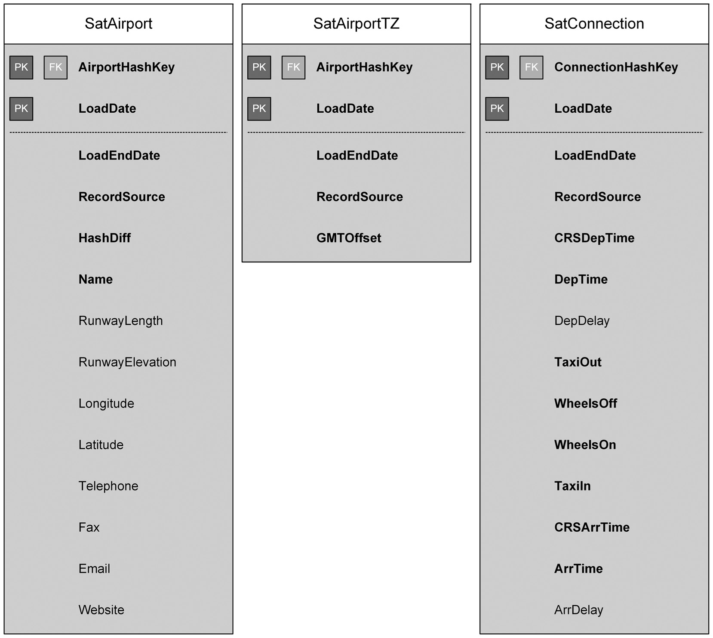

# 4.5.4 ПРИМЕРЫ СПУТНИКОВ (SATELLITE EXAMPLES)

<pre>
Figure 4.28 presents some examples of Data Vault satellites.
The first example, SatAirport, depends on HubAirport via the AirportSeq. The identifying primary key is a combination of the AirportSeq and the LoadDate (the date and time this record was seen by the data warehouse for the first time). In addition, the satellite uses the LoadEndDate and RecordSource metadata attributes. To speed up lookups on the satellite for detecting changes to the rows, the satellite also uses the optional HashDiff attribute. The rest of the satellite comprises descriptive attributes from the source system.
</pre>

Рисунок 4.28 представляет несколько примеров спутников Data Vault. Первый сателлит `SatAirport`- зависит от хаба `HubAirport` через `AirportSeq`. Идентифицирующий первичный ключ представляет собой комбинацию `AirportSeq` и `LoadDate` (дата и время, когда эта запись впервые была увидена хранилищем данных). Кроме того, сателлит использует метаданные атрибуты `LoadEndDate` (Дата окончания загрузки) и `RecordSource` (Источник записи). Для ускорения поиска в сателлите с целью обнаружения изменений в строках, сателлит также использует необязательный атрибут `HashDiff` (Хэш-разница). Остальная часть сателлита состоит из описательных атрибутов из системы-источника.
 

---
 
<pre>
SatAirportTZ was separated from SatAirport because it stores an attribute that changes more often than the descriptive attributes in SatAirport. While those attributes change very rarely (less than once in ten years), the GMT offset of a location changes twice a year (when the airport’s region observes daylight savings time). If the GMTOffset attribute were to be stored in the SatAirport, all descriptive attributes would be copied over to a new row, even though there was no change to the descriptive data.
</pre>

Сателлит `SatAirportTZ` (Часовой Пояс Аэропорта) был отделен от `SatAirport`, потому что он хранит атрибут, который меняется чаще, чем описательные атрибуты в `SatAirport`. В то время как эти атрибуты меняются очень редко (реже одного раза в десять лет), смещение GMT (часовой пояс) локации меняется дважды в год (когда в регионе аэропорта действует переход на летнее/зимнее время). Если бы атрибут `GMTOffset` был сохранен в `SatAirport`, все описательные атрибуты копировались бы в новую строку, даже несмотря на то, что в описательных данных не произошло никаких изменений.
  

---
  
<pre>
The last satellite is a satellite on a Data Vault link, LinkConnection. It stores all descriptive data to the connection. Because the information is provided in delta loads (the source system only provides new connection information), there is no need to look up which data already exists, hence no need for the HashDiff attribute.
</pre>

Последний сателлит — это сателлит на линк Data Vault, `LinkConnection` (Связь Соединения). Он хранит все описательные данные о соединении. Поскольку информация предоставляется в дельта-загрузках (система-источник предоставляет только новую информацию о соединении), нет необходимости выполнять поиск существующих данных, следовательно, нет необходимости в атрибуте `HashDiff`.
  

---
 

<figure style="text-align: center;">
  
  <figcaption style="font-size: 12px; color: #666; margin-top: 10px;">
    <strong style="color: #333;">FIGURE 4.28</strong> 
    Data Vault satellite examples (physical design)
  </figcaption>
</figure>

 

---