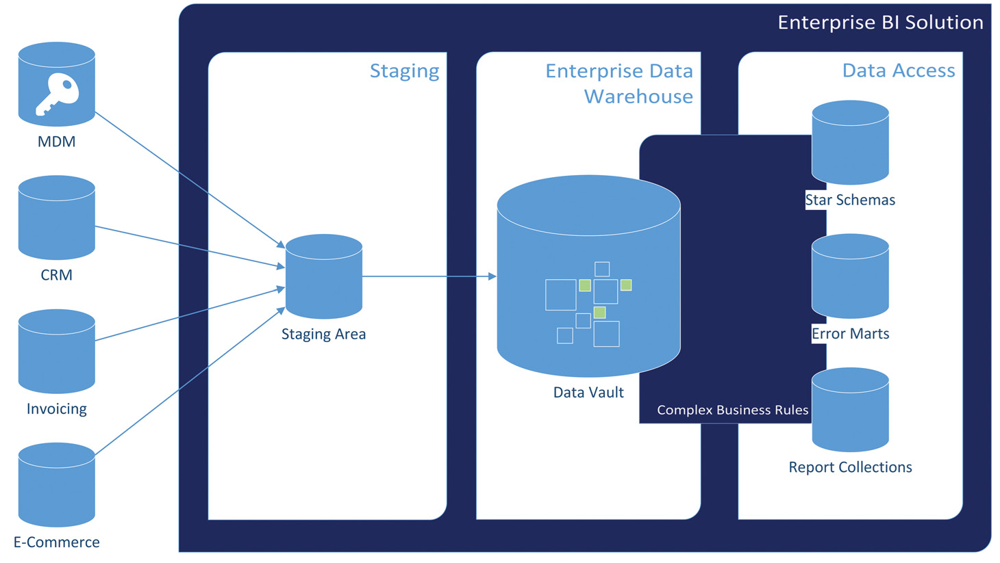

# 5 ПРОМЕЖУТОЧНОЕ МОДЕЛИРОВАНИЕ DATA VAULT (INTERMEDIATE DATA VAULT MODELING)

<pre>
The entity types presented in the previous chapter are the foundation for other Data Vault entities presented in this chapter. Many of these examples are just applications of existing link or satellite entities without changing the structure of the entity. These are often used in the Business Vault that was described in Chapter 2, Scalable Data Warehouse Architecture. In addition, this chapter discusses some important issues that often come up when designing and implementing a Data Vault based data warehouse. Note that this chapter is partially based on the book Super Charge Your Data Warehouse by Dan Linstedt [1].
</pre>

Типы сущностей, представленные в предыдущей главе, являются фундаментом для других сущностей Data Vault, рассматриваемых в этой главе. Многие из этих примеров представляют собой просто применения существующих сущностей линк (link) или сателлит (satellite) без изменения структуры самой сущности. Они часто используются в Бизнес-хранилище (Business Vault), которое было описано в Главе 2, «Масштабируемая архитектура хранилища данных». Кроме того, в этой главе обсуждаются некоторые важные вопросы, которые часто возникают при проектировании и реализации хранилища данных на основе Data Vault. Обратите внимание, что эта глава частично основана на книге Дэна Линдштедта «Super Charge Your Data Warehouse» [1].

 

---
  

## 5.1 ПРИЛОЖЕНИЯ ХАБОВ (HUB APPLICATIONS)
 
<pre>
Chapter 4, Data Vault 2.0 Modeling, has presented Data Vault hubs as the central entity used for storing business keys that identify business objects. In theory, an enterprise should have one leading operational system that keeps track of a specific business object. Customer relationship management (CRM) systems are good examples of such operational systems that are the main source for all customer-related information. In reality, however, business objects, such as customers, are stored in multiple operational systems, for example in retail databases, e-commerce applications, invoice management systems, and so on. Enterprises try to consolidate this information with a concept called master data management, which we briefly discuss in Chapter 9, Master Data Management.
</pre>

В Главе 4 «Моделирование Data Vault 2.0», хабы Data Vault были представлены как центральная сущность, используемая для хранения бизнес-ключей, идентифицирующих бизнес-объекты. В теории, у предприятия должна быть одна основная операционная система, которая отслеживает конкретный бизнес-объект. Системы управления взаимоотношениями с клиентами (CRM) являются хорошими примерами таких операционных систем, служащих основным источником всей информации, связанной с клиентами. Однако в реальности бизнес-объекты, такие как клиенты, хранятся в нескольких операционных системах, например, в базах данных розничной торговли, приложениях электронной коммерции, системах управления счетами и так далее. Предприятия пытаются консолидировать эту информацию с помощью концепции, называемой управлением мастер-данными (master data management), которую мы кратко обсудим в Главе 9, «Управление мастер-данными».

---
 

<pre>
Figure 5.1 shows that all data, including the business keys, is first loaded into the Data Vault layer via the staging area. The consolidation happens when the complex business rules are being processed and the information marts are being built. Data warehouse practitioners have to deal with multiple sources for a given business object. The major problem with having multiple sources is that each source has different capabilities for defining each business object. That is due to the different requirements that have been expressed by the business when these source systems have been built in the past. The result is that even the business key data types might be different: in some cases, the alphanumeric customer number (e.g., US4317 for a customer in the United States) that is defined on an enterprise level doesn’t fit into some other operational system because it won’t allow alphanumeric characters into the customer number. In that case, the business will rely on some sort of mapping tables that map customer US4317 in the CRM system to customer 132842 in the e-commerce application. (See section 5.2.2 for a more detailed discussion and an example of such a mapping table.)
</pre>

На Рисунке 5.1 показано, что все данные, включая бизнес-ключи, сначала загружаются в слой Data Vault через зону промежуточного хранения (staging area). Консолидация происходит при обработке сложных бизнес-правил и построении информационных витрин (information marts). Специалистам по хранилищам данных приходится иметь дело с несколькими источниками для данного бизнес-объекта. Основная проблема наличия нескольких источников заключается в том, что каждый источник имеет разные возможности для определения каждого бизнес-объекта. Это связано с различными требованиями, которые выдвигал бизнес при создании этих систем-источников в прошлом. Результатом является то, что даже типы данных бизнес-ключей могут отличаться: в некоторых случаях буквенно-цифровой номер клиента (например, `US4317` для клиента в США), определенный на уровне предприятия, не подходит для какой-либо другой операционной системы, потому что она не допускает буквенно-цифровые символы в номере клиента. В этом случае бизнес будет полагаться на своего рода таблицы маппинга (mapping tables), которые сопоставляют клиента `US4317` в системе CRM с клиентом `132842` в приложении электронной коммерции. (Более подробное обсуждение и пример такой таблицы маппинга см. в разделе 5.2.2.)

---
 

<pre>
Because this situation is more than common, the Data Vault has a solution to it. The recommended best practice is to load all business keys, regardless of their specific format, to one common hub (in this case the customer hub) and create a special link, called a same-as link (or SAL), to indicate the business keys that identify the same business object. The next section discusses hub consolidation with same-as links in more detail.
</pre>

Поскольку такая ситуация более чем распространена, в Data Vault есть решение для неё. Рекомендуемая лучшая практика заключается в загрузке всех бизнес-ключей, независимо от их конкретного формата, в один общий хаб (в данном случае хаб клиентов) и создании специальной связи, называемой линком «такой же как» (same-as link, или SAL), чтобы указать бизнес-ключи, которые идентифицируют один и тот же бизнес-объект. В следующем разделе консолидация хабов с помощью same-as links обсуждается более подробно.

<figure style="text-align: center;">
  
  <figcaption style="font-size: 12px; color: #666; margin-top: 10px;">
    <strong style="color: #333;">FIGURE 5.1</strong> 
    Consolidation of various sources in the data warehouse
  </figcaption>
</figure>

---
 

## Комментарии и разъяснения
 
Этот раздел знаменует переход от базового моделирования к решению реальных проблем корпоративной среды, где данные разрознены и нестандартизированы. Здесь вводятся ключевые концепции **Business Vault** и механизм решения проблемы множественных идентичностей.

### 1. Реальность против теории: проблема множественных источников
В идеальном мире существует одна «золотая запись» (Golden Record) для каждого объекта (клиента, продукта) в одной главной системе (например, CRM).
*   **Теория:** Один источник истины -> Один хаб.
*   **Реальность:** Клиент существует в:
    *   Старой ERP-системе (ключ: числовой `100500`).
    *   Интернет-магазине (ключ: email `user@example.com`).
    *   Мобильном приложении (ключ: UUID `a1b2-c3d4`).
    *   Файле Excel отдела продаж (ключ: ФИО + телефон).

Ситуация усугубляется тем, что форматы таких бизнес-ключей различаются (числа, строки, UUID), а бизнес-правила их формирования исторически сложились по-разному.

### 2. Стратегия Data Vault: «Загрузить всё» (Load All)
Вместо того чтобы пытаться привести ключи к единому стандарту *до* загрузки (что сложно и рискованно), Data Vault предлагает другую стратегию:
1.  **Единый Хаб:** Создайте один хаб (например, `Hub_Customer`).
2.  **Загрузка всех вариантов:** Загружайте в этот хаб *все* найденные бизнес-ключи из *всех* систем, независимо от их формата.
    *   Строка 1: `100500` (из ERP)
    *   Строка 2: `user@example.com` (из Web)
    *   Строка 3: `a1b2-c3d4` (из App)
    
    *Важно:* В хабе они пока считаются разными объектами, так как их бизнес-ключи не совпадают.

### 3. Решение: Same-As Link (SAL)
Чтобы связать эти разрозненные ключи и сказать системе: «Эй, это всё один и тот же человек!», используется специальная конструкция — **Same-As Link (SAL)**.
*   **Что это:** Это специальный тип линка, который соединяет две записи внутри *одного и того же* хаба (или между хабами одного типа).
*   **Как работает:** Он создает связь «эквивалентности».
    *   `Link_SAL` соединяет `Hash_Key(100500)` и `Hash_Key(user@example.com)`.
    *   Это позволяет позже, на слое витрин (Data Marts) или в Business Vault, применить правила консолидации и выбрать «мастер-запись», не теряя при этом историю всех исходных идентификаторов.

### 4. Роль Business Vault
Автор упоминает, что такие конструкции часто относятся к **Business Vault**.
*   **Raw Vault (Сырое хранилище):** Содержит все ключи как есть, без попыток их объединения. Это обеспечивает полную аудируемость и скорость загрузки.
*   **Business Vault:** Слой поверх Raw Vault, где применяются сложные бизнес-правила (включая логику SAL), маппинг и очистка данных. Здесь происходит превращение «множества ключей» в «единый взгляд на клиента».

### Иллюстрация концепции Same-As Link

Представьте, что к вам пришел клиент Иван Иванов.
1.  В старой системе он `ID: 55`.
2.  В новой системе он `Email: ivan@mail.ru`.

**В Raw Vault (Хаб Клиентов):**
| Hub_Customer_PK (Hash) | Business Key | Record Source |
| :--- | :--- | :--- |
| Hash_A | 55 | Legacy_ERP |
| Hash_B | ivan@mail.ru | Web_Shop |

Пока это две разные строки.

**В Business Vault (Same-As Link):**
| Link_SAL_PK | Hub_Customer_PK_1 | Hub_Customer_PK_2 | Load Date |
| :--- | :--- | :--- | :--- |
| Hash_Link_1 | Hash_A | Hash_B | 2026-03-20 |

Эта запись говорит: «Ключ `55` ТО ЖЕ САМОЕ, что и `ivan@mail.ru`».
Теперь при построении отчетов вы можете пройти по этой связи и объединить данные о покупках Ивана из обеих систем в единую историю.

### Резюме раздела
*   Не пытайтесь унифицировать ключи до загрузки в Data Vault.
*   Загружайте все вариации ключей в один хаб.
*   Используйте **Same-As Link (SAL)** для декларирования связей между разными ключами одного объекта.
*   Логика выбора главного ключа (Master Data Management) реализуется на последующих слоях (Business Vault / Info Marts), опираясь на связи SAL.

---
 

---
 

### 5.1.1 КОНСОЛИДАЦИЯ БИЗНЕС-КЛЮЧЕЙ (BUSINESS KEY CONSOLIDATION)

<pre>
As described in Chapter 2, Scalable Data Warehouse Architecture, the Business Vault is an extension to the raw Data Vault and allows data warehouse developers to add computed data to the Data Vault layer. This chapter will introduce computed aggregate links, exploration links, and computed satellites as examples of entity types that are part of the Business Vault. These entity types are modeled similarly to the core Data Vault entity types by following Data Vault modeling concepts, especially for links and satellites.
</pre>

Как описано в Главе 2, «Масштабируемая архитектура хранилища данных», Бизнес-хранилище (Business Vault) является расширением сырого Data Vault (Raw Vault) и позволяет разработчикам хранилищ данных добавлять вычисляемые данные на слой Data Vault. В этой главе будут представлены вычисляемые агрегирующие линки (computed aggregate links), линки исследования (exploration links) и вычисляемые сателлиты (computed satellites) в качестве примеров типов сущностей, являющихся частью Бизнес-хранилища. Эти типы сущностей моделируются аналогично основным типам сущностей Data Vault, следуя концепциям моделирования Data Vault, особенно для линков и сателлитов.
 

---
 

<pre>
However, it is possible to customize every standard Data Vault entity in order to meet the needs of the organization. These modifications, which become part of the Business Vault, are sourced from the raw data in the standard Data Vault entities (hubs, links, and satellites) and are often optimized to improve the performance when querying the data from the Data Vault. A common use case is to consolidate business keys from various sources, as shown in Tables 5.1 and 5.2 and Figure 5.2.
</pre>

Однако можно настроить любую стандартную сущность Data Vault в соответствии с потребностями организации. Эти модификации, становящиеся частью Бизнес-хранилища, берут начало из сырых данных стандартных сущностей Data Vault (хабов, линков и сателлитов) и часто оптимизируются для улучшения производительности при запросах к данным из Data Vault. Распространенным вариантом использования является консолидация бизнес-ключей из различных источников, как показано в Таблицах 5.1 и 5.2 и на Рисунке 5.2.
 

---
 

<pre>
In this case, there is a Passenger hub in the Raw Data Vault that has been sourced from multiple source tables providing passenger numbers. In too many organizations, source systems are used which are not integrated. Therefore, the same passenger exists in multiple operational systems, having different passenger identification numbers (such as driver license number or passport number) assigned. Another reason for this problem is that source systems can sometimes support different formats for the same business key.
</pre>

В данном случае в Raw Vault существует хаб пассажиров (`Passenger hub`), данные для которого поступают из нескольких исходных таблиц, предоставляющих номера пассажиров. Во многих организациях используются неинтегрированные системы-источники. Следовательно, один и тот же пассажир существует в нескольких операционных системах, имея разные идентификационные номера (например, номер водительских прав или номер паспорта). Другой причиной этой проблемы является то, что системы-источники иногда поддерживают разные форматы для одного и того же бизнес-ключа.

 

---
 

<pre>
In this example, source system Domestic Flight allows (and uses) numeric driver license numbers only, while system International Flight allows alphanumeric business keys. This situation is far from optimal but often arises when two organizations merge together and continue to use their old systems without proper integration. The problem is solved by attaching a same-as link structure to the hub to indicate which customer numbers are used for the same customer. There are multiple options to compute the records for the same-as link, and could result from customer de-duplication algorithms, as in this example. The corresponding entity-relationship (ER) diagram is presented in Figure 5.3.
</pre>

В этом примере система-источник `Domestic Flight` (Внутренние рейсы) разрешает (и использует) только числовые номера водительских прав, тогда как система `International Flight` (Международные рейсы) допускает буквенно-цифровые бизнес-ключи. Эта ситуация далека от оптимальной, но часто возникает, когда две организации объединяются и продолжают использовать свои старые системы без надлежащей интеграции. Проблема решается путем присоединения структуры same-as link (SAL) к хабу, чтобы указать, какие номера клиентов относятся к одному и тому же клиенту. Существует несколько вариантов вычисления записей для same-as link; они могут быть результатом алгоритмов дедупликации клиентов, как в этом примере. Соответствующая диаграмма «сущность-связь» (ER-диаграмма) представлена на Рисунке 5.3.

 

---
 

<pre>
This approach, based on a same-as link and a hub with a single business key, only works as long as the number ranges of both systems don't overlap. If that is the case, the same business key can identify multiple business objects in different systems. Instead of using one hub for all business keys from all source systems in the Raw Data Vault, there are two options to deal with this situation. First, the hub could be extended by another business key, identifying the source system. This artificial key becomes part of the hub's composite business key. This solution has the drawback that it won't integrate the source systems. Another solution is to create multiple hubs and link them using a link table. This solution documents the different business key usages in the model but requires more entities in the Raw Data Vault.
</pre>

Этот подход, основанный на same-as link и хабе с единым бизнес-ключом, работает только до тех пор, пока диапазоны номеров обеих систем не пересекаются. Если они пересекаются, один и тот же бизнес-ключ может идентифицировать несколько бизнес-объектов в разных системах. Вместо использования одного хаба для всех бизнес-ключей из всех систем-источников в Raw Vault, есть два варианта решения этой ситуации. Во-первых, хаб можно расширить дополнительным бизнес-ключом, идентифицирующим систему-источник. Этот искусственный ключ становится частью составного бизнес-ключа хаба. Недостатком этого решения является то, что оно не интегрирует системы-источники. Другое решение — создать несколько хабов и связать их с помощью таблицы линка. Это решение документирует различные способы использования бизнес-ключей в модели, но требует большего количества сущностей в Raw Vault.

 

---
 

<pre>
From a modeling standpoint, both solutions are far from being optimal, but this reflects the actual use of business keys in the source systems, by the business. However, in both cases, this is the correct approach, because Data Vault 2.0 modeling is oriented to the business. If an organization is using a suboptimal way to run their business, it is therefore reflected in the Data Vault model as well. When the data is transformed to the Business Vault, it is still possible to merge the business keys into one business hub, including a same-as link structure as shown in Figure 5.3. In fact, a same-as-link is actually a Business Vault entity, as long as the information is not pulled from the source system, instead of being maintained by human intervention or algorithms. However, if the business keys are merged into a business hub, they should not overlap and identify only one business object. This follows the Data Vault 2.0 standard and can be achieved by the use of pre- or postfixes (or formatting elements) for those business keys that are not from the leading source system. For example, if the leading system is a CRM application and doesn't provide a business key for a specific business object, the identifying business key is taken from a secondary source system and loaded into the business hub. An example of such a secondary source system might include a ticketing system where a customer is added but has never been synchronized or replicated to the CRM application. To indicate this suboptimal case and prevent confusion, the business key from the ticketing system is enclosed by brackets, e.g. "(4711)". This business key is then used in analytical reports and it is apparent for the business user that the key is not a key from the CRM application and cannot be found there. It is also possible to add the source system to the business key, e.g., "(TCK:4711)" to provide the business user an indication where the key is coming from.
</pre>

С точки зрения моделирования, оба решения далеки от оптимальных, но это отражает фактическое использование бизнес-ключей в системах-источниках самим бизнесом. Тем не менее, в обоих случаях это правильный подход, поскольку моделирование Data Vault 2.0 ориентировано на бизнес. Если организация использует неоптимальный способ ведения бизнеса, это также отражается в модели Data Vault. Когда данные трансформируются в Бизнес-хранилище, все еще возможно объединить бизнес-ключи в один бизнес-хаб, включая структуру same-as link, как показано на Рисунке 5.3. Фактически, same-as link является сущностью Бизнес-хранилища, поскольку эта информация не извлекается напрямую из системы-источника, а поддерживается посредством вмешательства человека или алгоритмов. Однако, если бизнес-ключи объединены в бизнес-хаб, они не должны пересекаться и должны идентифицировать только один бизнес-объект. Это соответствует стандарту Data Vault 2.0 и может быть достигнуто за счет использования префиксов или постфиксов (или элементов форматирования) для тех бизнес-ключей, которые получены не из ведущей системы-источника. Например, если ведущей системой является CRM-приложение, и оно не предоставляет бизнес-ключ для конкретного бизнес-объекта, идентифицирующий бизнес-ключ берется из вторичной системы-источника и загружается в бизнес-хаб. Примером такой вторичной системы может служить система продажи билетов, куда добавлен клиент, но который никогда не синхронизировался и не реплицировался в CRM-приложение. Чтобы указать на этот неоптимальный случай и предотвратить путаницу, бизнес-ключ из системы продажи билетов заключается в скобки, например, `(4711)`. Этот бизнес-ключ затем используется в аналитических отчетах, и пользователю бизнеса очевидно, что этот ключ не является ключом из CRM-приложения и не может быть там найден. Также возможно добавить название системы-источника к бизнес-ключу, например, `(TCK:4711)`, чтобы предоставить пользователю бизнеса указание на происхождение ключа.

 

---
 

<pre>
The query from such two tables could be relatively complex in some cases. In addition, the consolidated view of customer numbers is required in many cases, because business is interested in a consolidated list of customer keys instead of the raw data, except for some data quality reports. Therefore, it makes sense to provide the consolidated list, resulting from the complex query, in a new, materialized hub. This hub has the same structure as the hub in the Raw Data Vault, but with different data. Therefore, the statement from the beginning of this section remains valid: there is no special hub entity for the Business Vault. However, it makes sense to have Business Vault hubs in order to provide different sets of business keys to improve later querying. In such a case, the record source attribute is changed to "SYSTEM" or "SYS" to indicate that the value has been generated by the data warehouse system.
</pre>

Запрос к таким двум таблицам в некоторых случаях может быть относительно сложным. Кроме того, во многих случаях требуется консолидированное представление номеров клиентов, поскольку бизнес заинтересован в консолидированном списке клиентских ключей, а не в сырых данных (за исключением некоторых отчетов по качеству данных). Поэтому имеет смысл предоставить консолидированный список, являющийся результатом сложного запроса, в новом материализованном хабе. Этот хаб имеет ту же структуру, что и хаб в Raw Vault, но содержит другие данные. Следовательно, утверждение из начала этого раздела остается в силе: специальной сущности хаба для Бизнес-хранилища не существует. Однако имеет смысл создавать хабы Бизнес-хранилища, чтобы предоставлять различные наборы бизнес-ключей для улучшения последующих запросов. В таком случае атрибут `Record Source` изменяется на `SYSTEM` или `SYS`, чтобы указать, что значение было сгенерировано системой хранилища данных.

 

---
 

<pre>
This example is a typical case where business rules are applied in the Business Vault. While business rules are typically implemented when loading the information marts, it is a good practice to implement them if they are generally used in more than 80% of the reports, or if heavy lifting is necessary. In this case, heavy lifting equates to long-running or complex business rules. By doing so, reimplementing the business rules for every information mart can be avoided. This becomes even more important with complex and time-consuming business rules that are used in multiple information marts.
</pre>

Этот пример является типичным случаем применения бизнес-правил в Бизнес-хранилище. Хотя бизнес-правила обычно реализуются при загрузке информационных витрин, хорошей практикой считается их реализация на этом этапе, если они используются более чем в 80% отчетов или если требуется выполнение ресурсоемких операций («heavy lifting»). В данном случае «heavy lifting» означает долго выполняющиеся или сложные бизнес-правила. Поступая таким образом, можно избежать повторной реализации бизнес-правил для каждой информационной витрины. Это становится еще более важным для сложных и трудоемких бизнес-правил, используемых в нескольких информационных витринах.

 

---
 

<pre>
The other Business Vault entities in this chapter on links and satellites are used in similar cases and with the same reasoning as described in this section.
Chapter 6, Advanced Data Vault Modeling, discusses two other Business Vault entities (the PIT table and the bridge table) that are used in order to make querying the data from the Raw Data Vault easier and to increase the query performance. For that reason, they are also called query assistant tables.
</pre>

Другие сущности Бизнес-хранилища, рассмотренные в этой главе (линки и сателлиты), используются в аналогичных случаях и по тем же причинам, что описаны в этом разделе.
Глава 6, «Продвинутое моделирование Data Vault», обсуждает две другие сущности Бизнес-хранилища (таблицу PIT и таблицу мост), которые используются для упрощения запросов к данным из Raw Vault и повышения производительности запросов. По этой причине их также называют таблицами-помощниками для запросов (query assistant tables).

  ---

## Комментарии и разъяснения

Этот раздел углубляется в практические аспекты работы с неидеальными данными в корпоративной среде и объясняет роль **Business Vault** как слоя интеллектуальной обработки данных.

### 1. Проблема: Разрозненные идентичности (Identity Crisis)
В реальном мире редкая компания имеет единую систему учета клиентов. Обычно после слияний, поглощений или органического роста возникают «островки» данных:
*   **Система А:** Использует короткие числовые ID (например, `1234`).
*   **Система Б:** Использует сложные буквенно-цифровые коды (например, `C21X9`).
*   **Конфликт форматов:** Иногда одна система не принимает формат другой.
*   **Пересечение диапазонов:** Хуже всего, когда в Системе А есть клиент `100`, и в Системе Б тоже есть клиент `100`, но это разные люди.

Если просто свалить все ключи в один хаб без разбора, мы получим кашу, где невозможно понять, кто есть кто.

### 2. Решение в Raw Vault: Честность перед реальностью
Data Vault требует отражать реальность такой, какая она есть.
*   **Вариант 1 (Если диапазоны не пересекаются):** Загружаем все ключи в один хаб `Hub_Customer`. Даже если форматы разные (`1234` и `C21X9`), хэш-ключи будут разными, и конфликтов не возникнет.
*   **Вариант 2 (Если диапазоны пересекаются):**
    *   *Плохой путь:* Искусственно менять ключи (добавлять префиксы) уже на этапе Raw Vault. Это скрывает реальную проблему бизнеса.
    *   *Правильный путь (по книге):* Создать отдельные хабы для каждой системы (`Hub_Customer_Domestic`, `Hub_Customer_International`) и связать их обычным линком, либо добавить источник в составной ключ хаба. Это фиксирует факт раздробленности бизнеса.

### 3. Роль Same-As Link (SAL) и Business Vault
Здесь вступает в игру магия консолидации.
*   **Same-As Link (SAL):** Это специальный линк, который говорит: «Ключ `1234` из Системы А и ключ `C21X9` из Системы Б — это один и тот же человек».
*   **Откуда берутся данные для SAL?** Они не приходят из источника! Они генерируются внутри хранилища с помощью:
    *   Алгоритмов дедупликации (matching algorithms).
    *   Ручной работы аналитиков данных.
    *   Сложных бизнес-правил.
    Поскольку эти данные являются *вычисляемыми*, SAL живет в слое **Business Vault**.

### 4. Стратегия «Материализованный Хаб» (Materialized Hub)
Автор поднимает важный вопрос производительности.
*   **Проблема:** Чтобы получить список уникальных клиентов, нужно каждый раз делать сложный `JOIN` между Хабами и SAL-линками, применяя логику дедупликации. Это медленно.
*   **Решение:** Создать новый хаб в Business Vault (назовем его `Hub_Customer_Consolidated`).
    *   Он имеет стандартную структуру хаба (Hash Key, Business Key, Load Date, Record Source).
    *   В поле `Business Key` попадают уже очищенные, унифицированные ключи.
    *   Если ключ взят из вторичной системы, ему добавляют маркер, например `(TCK:4711)`, чтобы пользователь понимал происхождение.
    *   Атрибут `Record Source` устанавливается в `SYSTEM` или `SYS`, показывая, что ключ сгенерирован хранилищем.
*   **Выгода:** Отчеты обращаются к этому готовому хабу напрямую, без сложных соединений. Логика consolidation выполнена один раз при загрузке.

### 5. Когда использовать Business Vault?
Линдштедт дает четкий критерий (правило 80%):
Переносите сложную бизнес-логику (консолидацию, очистку, вычисления) из уровня витрин (Info Marts) в уровень Business Vault, если:
1.  Эти правила используются более чем в **80%** отчетов.
2.  Правила требуют тяжелых вычислений («heavy lifting»), которые тормозят загрузку витрин.

Это позволяет переиспользовать логику и не дублировать код в каждом процессе загрузки витрины.

### Иллюстрация потока данных

1.  **Sources:**
    *   Sys A: `ID: 100` (Client John)
    *   Sys B: `ID: 100` (Client Mike) -> *Конфликт!*
    *   Sys C: `ID: 55` (Client John)

2.  **Raw Vault:**
    *   `Hub_Client_A`: Key `100` (John)
    *   `Hub_Client_B`: Key `100` (Mike)
    *   `Hub_Client_C`: Key `55` (John)
    *(Здесь мы честно храним три разные записи)*

3.  **Business Vault (Processing):**
    *   Алгоритм сравнивает имена/адреса и понимает, что `Hub_Client_A.100` и `Hub_Client_C.55` — это один человек.
    *   Создается `Link_SAL`: соединяет хэши A и C.
    *   Создается `Hub_Client_Consolidated` (Materialized):
        *   Запись 1: Key `CRM:100` (Master)
        *   Запись 2: Key `(SYS_C:55)` (Linked to Master)
        *   *(Запись про Mike остается отдельной)*

4.  **Information Marts:**
    *   Берут данные из `Hub_Client_Consolidated`. Пользователь видит единый список клиентов, где дубли устранены, а происхождение ключей понятно благодаря префиксам.

### Резюме
*   **Raw Vault** хранит сырые ключи как есть, даже если они дублируются или конфликтуют.
*   **Same-As Link (SAL)** связывает эквивалентные ключи из разных систем.
*   **Business Vault** — место для хранения результатов дедупликации и сложных правил.
*   **Материализованные хабы** в Business Vault ускоряют работу витрин, предоставляя готовый, очищенный список ключей с маркировкой источника (`SYS`, префиксы в скобках).
*   Не бойтесь отражать несовершенство бизнес-процессов в модели; ваша задача — сделать их видимыми и управляемыми.

